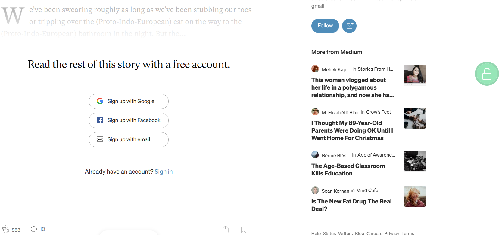
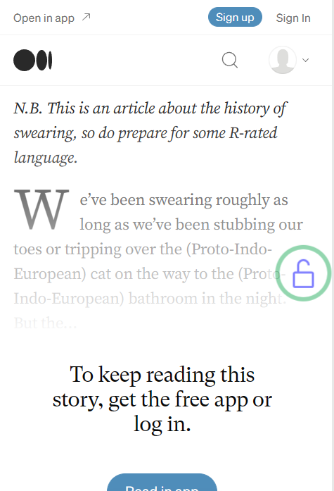

# Medium Unlock

___
自动检测Medium文章（包括子域名和自定义域名），替换URL为scribe.rip来解锁Medium付费文章

Automatically detect Medium articles (including subdomains and custom domains) and replace the URL with scribe.rip to unlock Medium articles.
___
## 使用方法（Usage）
点击文章页面出现的绿色悬浮球

Click on the green hoverball that appears on the article page, if this ball does not appear please check if your script has been installed correctly
## 插件原理（How the plugin works）
[scribe.rip](https://scribe.rip)

判断当前页是否为Medium文章，按照scribe.rip提供的方案替换url，通过访问scribe.rip来获得全文。

scribe.rip官方给出的自动化替换URL方式为[LibRedirect](https://libredirect.codeberg.page/)，但是在实际使用过程中体验不太好。

Determine whether the current page is a Medium article, replace the URL according to the scheme provided by [scribe.rip](https://scribe.rip), and get the full text by visiting [scribe.rip](https://scribe.rip).

The automated replacement method suggested by [scribe.rip](https://scribe.rip) is [LibRedirect](https://libredirect.codeberg.page/), but the actual experience of using it is not very good.
## 支持网站（Supported Sites）
- [Medium](https://medium.com)
  - medium.com
  - *.medium.com
    - james.medium.com
    - robert.medium.com
    - ...
  - custom domains
    - entrepreneurshandbook.co
    - ...

## 屏幕截图（Screenshot）

## LICENSE
[MIT LICENSE](./LICENSE)